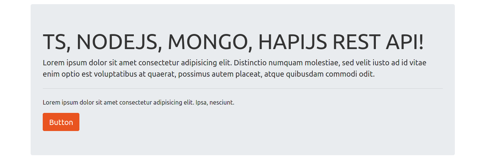

# TYPESCRIPT, NODEJS, MONGODB and HAPIJS REST API :rocket:

This is a rest api that can create, delete, update and list users and storage in a mongodb database.

> This project is a typescript practice.

## Technologies used for this project :computer:

- [typescript](https://www.typescriptlang.org/)
- [nodejs](https://nodejs.org/en/)
- [mongodb](https://nodejs.org/en/)
- [hapi](https://www.npmjs.com/package/hapi)

## Screenshots :camera:



## Installation

> The database (mongo) must be have running at port 27017 (default port)

```cmd
git clone https://github.com/gabrielba15/typescript-nodejs-mongodb-hapijs-restapi.git
cd typescript-nodejs-mongodb-hapijs-restapi
npm install
npm run build
npm start
```

> Ready, happy hacking :D
